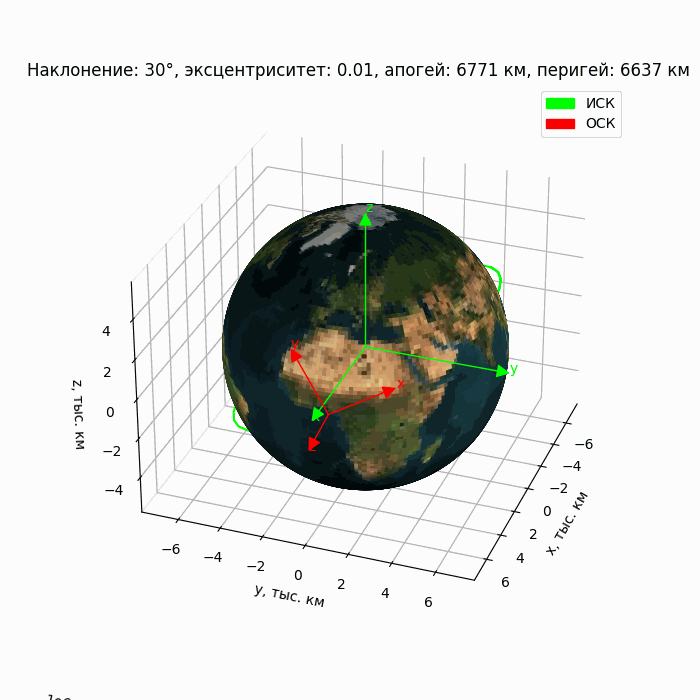
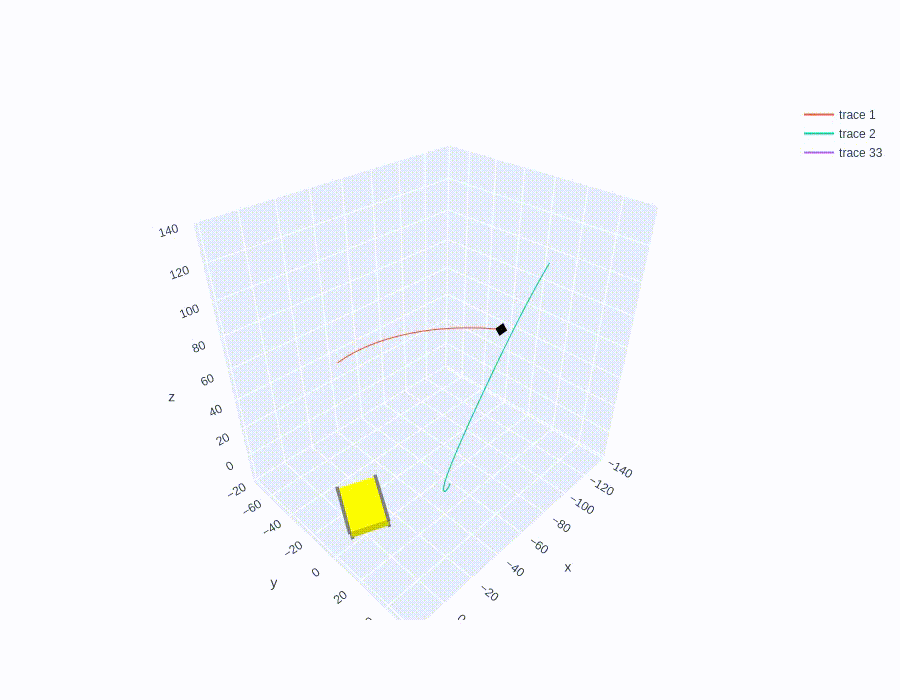

# Python-проект для аспирантского диплома
| Тема дипломной работы | Определение относительного движения космических аппаратов в групповом полёте |
|-----------------------|------------------------------------------------------------------------------|
| Кафедра               | Математического моделирования и прикладной математики                        |
| Физтех-школа          | Прикладной Математики и Информатики (ФПМИ)                                   |

 "Помнишь, я тебе говорила про мусор, который стоит? Стоит и смердит? Так вот — это была метафора. Я имела в виду тебя."

---

#### Способы основного численного моделирования:
- v.DYNAMIC_MODEL = 'rk4': НОО, e=0
- v.DYNAMIC_MODEL = 'kiamastro': ИСК полное моделирование, переход в ОСК при любом e, i

---
Пока что задача на этапе НОО: 

Плохой пример обнаружения чипсата только по оценке расстояния:

